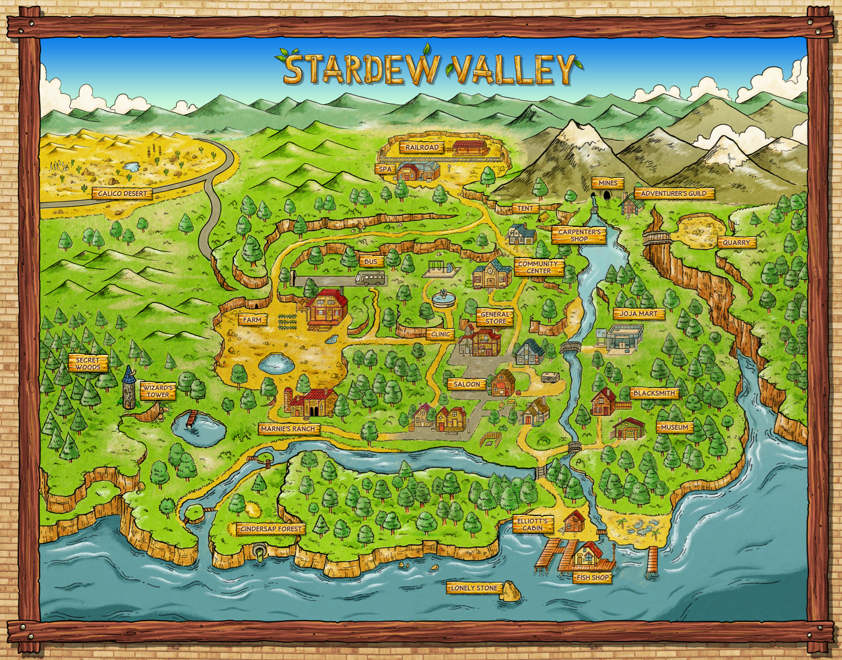
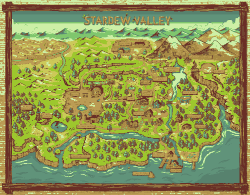

# CrossStitch

Testing out making a cross-stitch template generator

DMC conversion table comes from [bmanturner](https://github.com/bmanturner/hex-dmc/blob/master/est_dmc_hex.txt)

## Dependencies

[Pillow](https://pypi.org/project/Pillow/), [progress](https://pypi.org/project/progress/)

`pip install pillow progress`

## Example Usage

Input image:



With a specified width of `500` and `10` max DMC colors:

Output DMC-only image:



Cross-stitch template:


Index key:

```plaintext
Index   DMC Code  DMC Name                 DMC RGB           DMC HEX   Actual RGB        Actual HEX     Count
0       369       Pistachio Green - VY LT  (205, 239, 166)   cdefa6    (203, 218, 150)   cbda96         16772
1       3819      Moss Green - LT          (204, 201, 89)    ccc959    (188, 198, 85)    bcc655         10087
2       734       Olive Green - LT         (187, 156, 84)    bb9c54    (196, 175, 83)    c4af53         21172
3       368       Pistachio Green - LT     (127, 198, 109)   7fc66d    (136, 188, 121)   88bc79         8639
4       907       Parrot Green - LT        (157, 199, 45)    9dc72d    (138, 188, 24)    8abc18         31559
5       3816      Celadon Green            (96, 147, 122)    60937a    (110, 163, 125)   6ea37d         24054
6       733       Olive Green - MED        (167, 138, 68)    a78a44    (159, 138, 67)    9f8a43         22558
7       502       Blue Green               (87, 130, 110)    57826e    (79, 137, 109)    4f896d         12490
8       840       Beige Brown - MED        (122, 89, 57)     7a5939    (112, 99, 56)     706338         27826
9       3857      Rosewood - DK            (106, 47, 38)     6a2f26    (107, 59, 40)     6b3b28         20343

```
